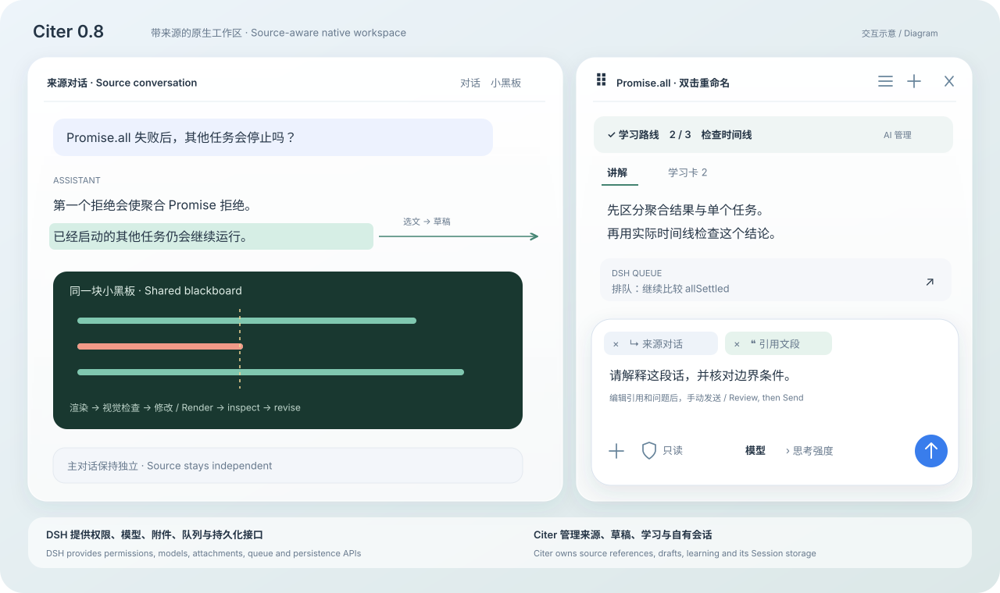
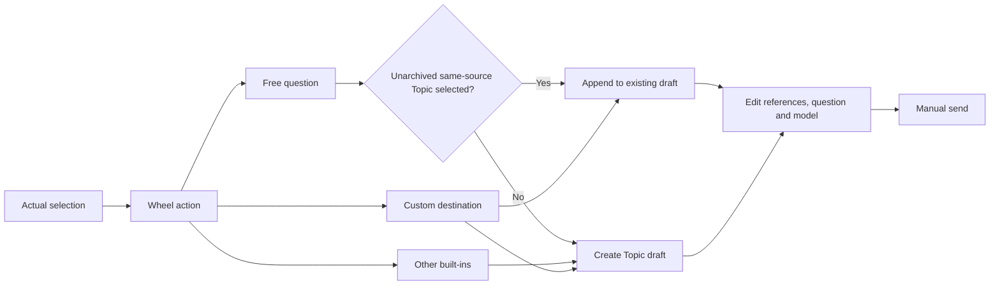

# CiteCiter

[简体中文](README.md) · [npm](https://www.npmjs.com/package/@kirkchinese/dsh-citeciter) · [Issues](https://github.com/kirkchinese/CiteCiter/issues)

> **0.8.0 is deprecated.** On Linux, starting DSH through a symlink can prevent Topic creation or restoration with a missing `@deepseek-ai/dsh-agent-loop` error. For DSH 0.1.5-rc.1 / Desktop 2.0.9, upgrade to [0.8.2](https://github.com/kirkchinese/CiteCiter/releases/tag/v0.8.2). For DSH 0.1.7, read the compatibility notice below first.

CiteCiter adds a source-aware workspace to DeepSeek Harness. Create independent Topics from conversations, tool results and documents for text, programming, image and learning tasks. New Topics use native DSH Sessions, permissions, models, attachments and message queues. The source conversation continues independently.

[](https://www.bilibili.com/video/BV1tqeA65EJ8/)

[Watch on Bilibili](https://www.bilibili.com/video/BV1tqeA65EJ8/). The video shows a released version; this branch's wheel routing and alpha migration are described below.



This is a 0.8 workspace diagram, not a screenshot, with the optional learning route explicitly enabled. This branch routes references as follows; model work still starts only after manual submission.



## Version and installation

This is **0.9.0-alpha.1, a prerelease on npm next**, targeting Web DSH `0.1.7-rc.2` and the same DSH bundled with [DSH Desktop 2.0.15](https://github.com/anywhere-labs/dsh-desktop/releases/tag/v2.0.15). Separate Host/Client compile checks against DSH `0.1.5-rc.2` remain; they do not establish functional acceptance of the latest Desktop. The stable release is **0.8.2**, targeting DSH `0.1.5-rc.1` / Desktop `2.0.9`. Node.js must satisfy `^22.19.0 || >=24.0.0`. Linux acceptance is excluded from this round.

**Do not use 0.8.2 with DSH 0.1.7.** Its exact peer ranges fail the compatibility gate; forcing installation then fails Typert activation because `create()` factories are missing. See [Issue #9](https://github.com/kirkchinese/CiteCiter/issues/9). This release supports the RC2 gate and Host/Remote factories without `allow-version`. Install this prerelease instead of forcing the old package through a compatibility exemption.

| Version | Status | Main differences |
| --- | --- | --- |
| 0.9.0-alpha.1 | Prerelease; npm next | Dual-host adapters, durable drafts, PTC tool display, reference routing and learning-route policy |
| 0.8.2 | Stable | Explicit source horizons and continuation; native first-answer question suggestions |
| 0.8.1 | Published | Fix Topic startup through Linux/macOS launcher symlinks |
| 0.8.0 | Deprecated; upgrade to 0.8.2 | Linux launcher symlinks can prevent Topics from opening |
| 0.7.0-beta.3 | Previous development candidate | Private read-only Topics, selection wheel, manual five-stage learning |
| 0.6.0 | Published | DSH 0.1.2-rc.1 / Desktop 2.0.5 baseline |

For DSH 0.1.7, install this prerelease:

```powershell
npm install -g @deepseek-ai/dsh@0.1.7-rc.2
dsh plugin --profile web add @kirkchinese/dsh-citeciter@0.9.0-alpha.1
dsh web
```

`next` selects the prerelease series; `latest` stays at 0.8.2 for DSH 0.1.5-rc.1 / Desktop 2.0.9 only. For DSH 0.1.2-rc.1 / Desktop 2.0.5, keep using @kirkchinese/dsh-citeciter@0.6.0. If npm blocks native dependency installation scripts, follow its output to allow the named dependencies and reinstall. Do not disable script restrictions globally.

In 0.8.0, launching DSH through a Linux/macOS symlink can prevent Topics from opening with a missing dsh-agent-loop error. Version 0.8.1 resolves the real CLI entry before loading host modules and retains Desktop's app.asar anchor. Native Linux Node regression passed; macOS has not been tested.

Build and install this branch locally:

```powershell
npm install -g @deepseek-ai/dsh@0.1.7-rc.2
pnpm install --frozen-lockfile
pnpm typecheck
pnpm typecheck:desktop
pnpm build
pnpm --dir packages/citeciter pack --pack-destination E:/project/CiteCiter/.refs/artifacts
dsh plugin --profile web add E:/project/CiteCiter/.refs/artifacts/kirkchinese-dsh-citeciter-0.9.0-alpha.1.tgz
```

Desktop bundles its own DSH. Version 0.8.2 retains the accepted Desktop 2.0.9 baseline. This release targets Desktop 2.0.15: run `dsh plugin add @kirkchinese/dsh-citeciter@0.9.0-alpha.1` in its managed terminal. Updating the global CLI does not update Desktop's embedded runtime. Restart the relevant host after installation. Do not run Web and Desktop writers against the same DSH home simultaneously.

Known host limitation: Windows read-only PowerShell can reject the host encoding initialization under ConstrainedLanguage, and some Chinese output can be garbled. Citer retains the original errors without raising permissions or hiding output; DSH must fix the executor. This prerelease makes no native acceptance claim for Linux/macOS or the separate Desktop NEXT shell.

## Source reading and suggested questions

`read_source_session` returns byte-bounded pages. `sourceMaxSeq` is the readable snapshot horizon; the legacy `availableThroughSeq` is request-bounded and does not indicate source exhaustion. When `hasMore` is true, pass `nextFromSeq` as the next `fromSeq` and omit `throughSeq`. `truncated` only marks a byte-budget stop within the range. Empty pages, filtered events and oversized placeholders do not prove missing evidence. Observer reads currently committed events; Exact Fork reads only the inherited prefix.

Native Topics offer three suggested questions after the first answer by default; disable them in CiteCiter settings. The prompt omits suggestions when the current request excludes them, asks for only a result, or imposes a strict format or length limit. Clicking a question only fills the draft and still requires manual submission. Source instructions and question suggestions are separate prompt modules; source contents remain gated by submitted attachments.

## Drafts and references

1. Select text in the source conversation, hold the right mouse button, point at a wheel action and release. Tool results, the document reader and native file previews provide additional entry points.
2. Free question adds the selection to the selected unarchived Topic; it creates a Topic when none is selected or the selected Topic is archived. Other built-in actions create Topics by default, and custom actions choose their destination. Append only within the current source, retaining the draft, model and permissions. Source addresses and excerpts are removable attachments. The plus button selects actual files or images; it does not manufacture references.
3. Review the question, references, permissions and model, then click Send or press Enter. Shift + Enter inserts a newline; Enter during IME composition does not submit.

Creating Topics, choosing wheel actions, changing models and quoting boards do not call a model. Wheel actions go directly to the Citer composer, where the user edits the question, references and model before sending. Custom actions targeting an existing Topic append their prompt after the current draft. Submitted prompts and references are recorded in the Topic's native log.

Removing an unsent source attachment makes its reading tool reject access; new Topics do not silently inherit source history. Previously sent references remain in conversation history: removing a later draft copy does not retract them. Draft text, actual references and attachment bytes are stored in the owning Topic's `draft/` directory and restored after panel close, Topic switches, reload and restart. Restoration never sends a message. Model, reasoning and permission choices continue to use host-persisted state. Background polling in another window does not replace the last-used Topic; navigation restoration follows explicit actions.

Drafts do not enter model logs or grant source access. Only host-confirmed submission contents are cleared; edits made during submission survive. Rejected sends retain the draft. Lost responses display a pending state for explicit reconciliation or retry. Concurrent save conflicts preserve local input and ask which version to keep. Choosing the local draft restores attachment bytes still held by this window if another window removed them. Missing or damaged attachments surface errors. Permanent Topic deletion includes its draft. Older Desktop refuses writes to newer session formats; continue in the newer Web host instead of manually downgrading logs.

## Permissions, input and queue

Model menus support arrow keys, Home/End and Enter. Submenu changes keep focus inside the menu; the model button retains focus and blocks repeated actions while saving.

New Topics start **read-only**, even when their source has full access. The input's permission menu selects native DSH read-only, workspace-write or full-access mode. Modification requires an explicit user mode choice or changed new-Topic default. DSH approval, sandbox and tool policies remain active.

Input controls are attachments, permission mode, model/reasoning and Send. Choose the model first, then one of its supported reasoning levels. Images and generic files use native DSH attachment services, with upload state and retry. Select files from the attachment menu, paste images into the input, or drop files onto the Citer panel. The drop invitation names the receiving Topic; release adds attachments only to that Topic. Drops are unavailable without a current Topic, and files dropped into Citer are not copied into the source draft. Mixed image and text paste retains both. Sent files show a download icon and filename; click to save the original attachment. Click a historical image to preview it inside the host. Escape, the backdrop or the close button dismisses the preview and restores focus to the image. User messages omit the role label. Host rejection shows its cause and retains the draft; an accepted message is cleared even if the subsequent status read fails.

While a reply runs, Enter and Send follow DSH's busy-send preference; Ctrl + Enter temporarily uses the other delivery mode. Queued messages run after the current turn; steering is admitted at its next step. The composer toggle overrides the current Topic without changing the host default. Pending rows can be removed or changed to steering. Stop ends the response and preserves existing output; pending work follows DSH's queue rules.

New Topics use standard programming tools under DSH permissions. Existing records retain their conversation and permissions when migrated into the source directory. Migration verifies every event; records that cannot be verified stay in their original store with an error report. Permissions are not expanded automatically.

DSH tool approvals, clarification questions and plan confirmations appear in their owning Topic, with decisions handled by the native host interaction service. Approval cards retain the tool name, reason and related parameters for inspection.

Model-provided reasoning appears in an expandable Thinking row. While reasoning is streaming before the answer, the row shows Thinking in progress. Collapsed rows retain a one-line preview; expanding displays the full Markdown. Models that return no reasoning do not produce an empty row.

After the host accepts a manual submission, the transcript follows the latest message. Model output alone preserves the user's position while reading earlier messages.

## Learning, boards and images

Learning route is off by default. While off, the current prompt prevents old messages or todo items from reviving a teaching route; a single explanation or board request does not enable it. Ordinary coding plans remain available. When enabled, a submitted question asks the model to select and maintain a plan through DSH `todo_write`, using underlying logic, qualitative analysis, quantitative board work, concept connections and summary cards as needed. The user's scope, length, tool constraints and card count take precedence; the route does not expand the request into one task per stage.

The board appears once, in the host conversation's blackboard tab. It supports text, Markdown, math, tables, SVG, images and isolated HTML. Quoting adds a draft attachment; math renders as math rather than raw object fields. Read, export and revise cards in Citer's Cards view. Examples explicitly use text or code: text renders as Markdown; code uses the native code block with its language, line breaks, indentation and copy button. Exports include code fences, and older cards remain readable.

`blackboard_view` returns a browser-rendered PNG to an image-capable model, allowing it to inspect clipping, labels, arrows and layout before updating the board. The image contains only the board, not the conversation or window layout. A separate capture worker renders the requested Topic and board revision offscreen at 1000×680 when another Topic is selected, the Citer panel is closed, or a narrow layout hides the board. Keep the DSH Web or Desktop page connected. SVG colors are preserved; Markdown code uses backgrounds suited to the dark board. Sandboxed HTML iframes cannot be captured; use SVG for inspectable diagrams.

Compatible host plugins can provide `codex_connect_image_generate` and `view_image` to Topics. Citer does not manage their accounts. The current upstream [dsh-codex-connect](https://github.com/franksong2702/dsh-codex-connect) `0.1.0-alpha.4.52` supports DSH RC1/RC2 without local patches or version exceptions. Image capabilities are off by default: open Settings → Built-in plugins → Codex Connect → Capabilities, enable GPT Image generation, and save. Web and Desktop have separate profiles; configure each profile separately. Installation alone does not enable the tools. `view_image` has its own Enable view_image tool switch; enabling image generation does not enable it. Generation, uploaded-image editing and display are tracked in the [current acceptance record](docs/validation/2026-09-27-connect-450.md); previous versions do not establish current acceptance.

Before saving cards, the model is instructed to check definitions, conditions, derivations, numbers and contradictions, then correct or mark unverified claims. Self-review does not ensure factual accuracy; acceptance found and corrected a model error. See the [validation record](docs/validation/2026-09-12-native-real-model.md). Active recall is optional and off by default. There is no spaced repetition, reminder or streak system.

## Topics and layout

The list icon opens searchable Topics for the current source; ＋ creates a blank Topic. Double-click the title or press F2 to rename; Enter/blur saves and Escape cancels. Archive hides a Topic while preserving its records, and the archive list restores it. Submitting a new message in an archived Topic returns it to the active list after host admission; rejected submissions preserve the archive state and draft. Permanent deletion requires the full Session ID and removes only Citer-owned Topic files after releasing its runtime. Symlinks and paths outside the owned directory are rejected. Source Sessions are never deleted.

Wide windows keep source and Citer side by side, with a resizable divider. Drag the title area away to float; release at the right window edge to dock. Opening native file details temporarily hides Citer when both panes cannot fit. Closing details restores the same Topic, draft and model. Explicitly selecting Citer or a file-selection action opens the compact Citer page; its top-left Back button restores the prior view. Without details, narrow screens use this page directly rather than placing Citer below the source. Closing restores host space and preserves Desktop captions.

Surfaces use translucent backgrounds, blur and short transitions, respecting host themes and reduced-motion settings. A dedicated adapter owns layout changes; unknown host structures do not receive an intrusive full-screen fallback.

## Storage and migration

Topics appear only in Citer navigation. DSH does not recursively discover nested Topic logs. Citer owns live membership and navigation; native send services can address a loaded Topic by identity.

```text
.dsh/sessions/<workspace>/<sourceSession>/
├── session.v4.jsonl[.zstd]       DSH-owned source
└── citeciter/
    ├── owner.json              Verified source ownership
    ├── <topicNumber>/
    │   ├── topic.json          Title, archive state, model and source
    │   ├── draft/              Unsent text, references and attachment bytes
    │   └── sessions/<workspace>/<citerSession>/session.v4.jsonl
    └── migration-backups/      Verified original copies
```

Citer owns creation, archive, restore and deletion. Archiving preserves the full log. Deletion leaves other Topics, the source and migration backups intact. Migration reads and writes through public DSH persistence APIs, compares the header and every event before switching the index, and retains originals. Moving verified old copies out of the main list requires an explicitly confirmed scope.

Alpha uses v4 logs. DSH reads and migrates older v3 logs; Citer does not rewrite event sequences or `seedLength`. Sources with historical logs remain addressable through their physical source directory.

## Documents and native preview

While Citer is open, use the top-right … → Document reading action. The standalone reader launcher remains available when Citer is closed and no longer covers its composer.

Click 📖 to import `.txt`, `.md` or `.markdown`. The reader preserves the full document, displays at most 500 KiB of UTF-8 text per page and accepts up to 2,000,000 characters. Paging clears the previous selection but keeps the question. Preparing a draft collapses the reader. The document address and excerpt are separate removable attachments.

Document tools return the full UTF-16 length and actual read range. Search results expose the valid endpoint; reads distinguish the requested cap, returned endpoint and remaining content. Continue with nextFromOffset and omit throughOffset when the end is unknown. Invalid ranges report explicit bounds instead of silently clamping them.

When the optional documentPreviews service is present, select “CiteCiter 学习” in native file preview. The host reads the file; Citer provides selectable source text, pagination and references. Creating a Topic stores a complete snapshot, unaffected by later file changes. Each snapshot is limited to 8 MiB / 2,000,000 characters and requires a source Session address.

This branch compiles against public subpackage types `0.1.7-rc.2`; the preview service remains optional. Without it, conversation actions and the independent reader remain usable. The learning viewer does not provide PDF text extraction, Word parsing or OCR. Selections from different documents can join one Topic; reads identify documents by their submitted attachment addresses.

## Wheel settings

Configure the trigger, default model and eight slots in Settings → CiteCiter. Defaults are Ask, Explain, Find errors, Translate, Quantitative board, Summary cards and two empty slots. Each slot has a prompt, input hint, draft destination, content mode and default placement. Save slot edits explicitly.

A short right-click leaves a clickable wheel; Shift + right-click preserves the native menu. Arrow keys, digits 1–8 and Enter select actions. Center, empty slots, outside release, Escape, source changes or wheel blur cancel. There is no preliminary question dialog; the Citer composer owns the draft.

## Sibling project

CiteCiter and [Claude2DSH](https://github.com/kirkchinese/claude2dsh), by the same author, serve one workflow: moving knowledge between agent tools and then reusing it.

- **Claude2DSH** — migrates Claude Code conversations, skills, subagents, slash commands, memory and MCP servers into DeepSeek Harness as native resumable sessions and assets, and exports back. It brings the past context in; CiteCiter keeps what you conclude from it traceable.

Both follow the same rules: public extension points only, nothing written into a foreign tool's directory without explicit authorization, and a real-profile acceptance run before every release. If you are reorganizing past sessions, importing first makes citing them much easier.

## Development and acceptance

[Contributing](CONTRIBUTING.md) · [Alpha changes](docs/releases/v0.9.0-alpha.1.md) · [Current acceptance status](docs/validation/2026-09-27-connect-450.md) · [0.8.2 fix notes](docs/releases/v0.8.2.md)

Host and Client compile separately. Native session adaptation, source reading, index storage, attachments, queue, board capture, learning plans and UI controls are separate modules. The DSH Agent Loop is unchanged. The full host input component has no supported cross-session embedding interface; Citer reuses public ConversationController / SessionFace behavior and does not automatically inherit every third-party composer extension.

Artificial model providers, test directories and temporary acceptance scripts have been removed from the current branch, with Git history preserved. CI checks dependencies, types, build and packaging. Functional acceptance uses real models, real source branches and actual UI; the validation record states coverage and unfinished work.

MIT License.
