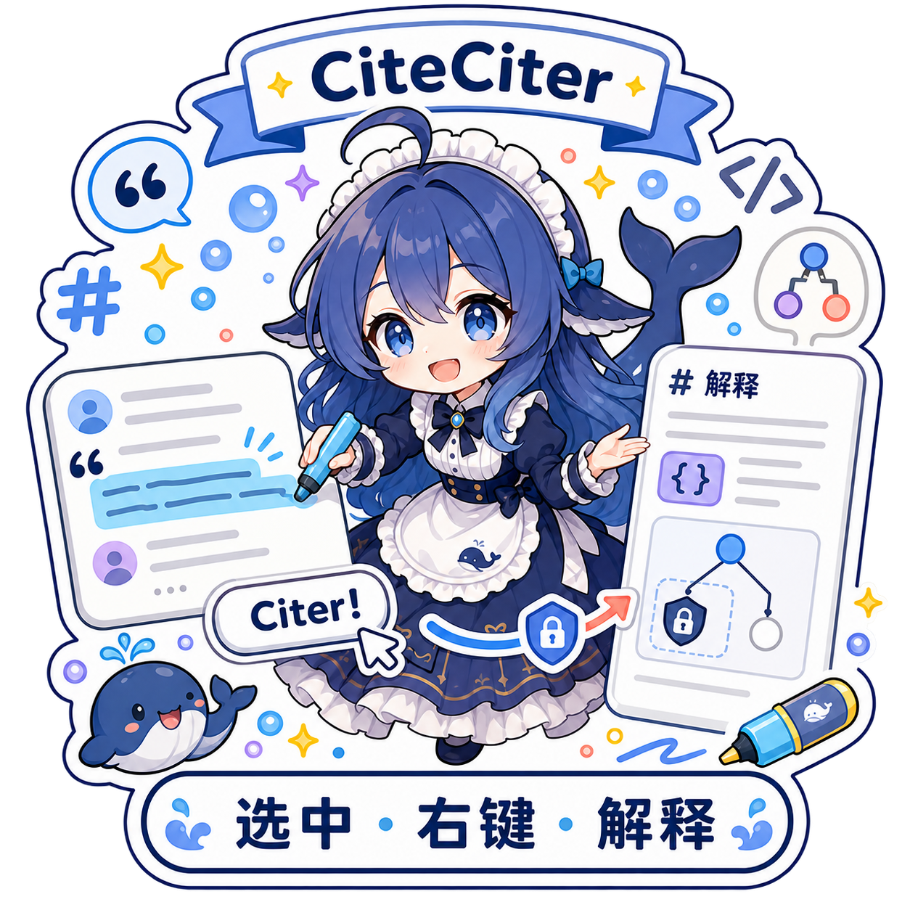

<p align="center">
  
</p>

<h1 align="center">CiteCiter</h1>

<p align="center">A private learning companion for live DeepSeek Harness conversations.</p>

<p align="center">
  <a href="https://www.npmjs.com/package/@kirkchinese/dsh-citeciter"></a>
  <a href="LICENSE"></a>
</p>

<p align="center">
  <a href="README.zh.md">简体中文</a> ·
  <a href="https://www.npmjs.com/package/@kirkchinese/dsh-citeciter">npm</a> ·
  <a href="https://github.com/kirkchinese/CiteCiter/issues">Issues</a>
</p>

CiteCiter lets you select text from a committed AI response, ask about it beside the source, and continue learning in a separate multi-turn Topic. The source Agent keeps working, and the source Session stays unchanged.

## See it in DSH

<p align="center">
  
</p>

<p align="center"><sub>Ask beside the source while CiteCiter inspects reasoning, source events, and project files through read-only tools.</sub></p>

<p align="center">
  
</p>

## Install

CiteCiter requires Node.js `^22.19.0 || >=24.0.0`, DSH Web `>=0.1.0-rc.7 <0.1.0-rc.8`, and a configured model provider.

```sh
dsh plugin --profile web add @kirkchinese/dsh-citeciter@0.3.2
```

Restart the corresponding DSH Web process and refresh the page after installation or upgrade.

## Use

1. Select text inside a committed assistant model call. The surrounding Agent turn may still be running.
2. Right-click the selection, enter your first question, and choose `Citer!`.
3. CiteCiter creates a new Topic in the learning dock.
4. Continue asking questions there, or reopen an earlier Topic from CiteCiter's Topic rail.
5. Change the Topic model, reasoning effort, title, archive state, or dock width without changing the source Session.

## Highlights

- **Model-call citations.** Start learning as soon as an `assistant/message` is committed; there is no need to wait for the full Agent turn to end.
- **Private Topics.** Each submission creates an independent DSH Session under `$DSH_HOME/citeciter/`, outside the ordinary Session list.
- **Precise selections.** Visible Markdown selections map back to Host-verifiable source ranges.
- **Cross-flow selections.** A range spanning reasoning, tools, and body text binds to its final committed assistant call while retaining the complete visible quote in the learning workspace.
- **Bound evidence.** `read_source_session` reads committed events from one fixed source Session without exposing its physical log path.
- **Open-ended investigation.** The standard read-only `glob` and `grep` tools discover project files and search their contents before `read` opens a known path.
- **Read-only operation.** CiteCiter cannot write to the source Session or source workspace.
- **Inspectable workflow.** Live reasoning, prompt injections, tool calls, results, and user questions use compact expandable rows inside the learning dock.
- **Natural follow-ups.** After the first answer, the model may emit three strictly formatted next questions; malformed output creates no shortcuts and is logged silently.
- **Native workflow.** The selection popover, resizable learning dock, active/archive Topic navigation, and settings stay inside the DSH programming interface.

## Context modes

Observer is the default. It creates an independent Topic and reads committed source evidence on demand, including while the source turn is still running.

Exact Fork is an advanced mode for a source turn that has already ended. `exact-when-available` uses Exact Fork when a stable boundary exists and otherwise falls back to Observer.

## Upgrade from v0.2

Install v0.3 with the same command, then verify the installed version:

```sh
dsh plugin --profile web add @kirkchinese/dsh-citeciter@0.3.2
dsh plugin --profile web list --depth 0
```

The upgrade does not rewrite source Sessions or import v0.2 Citation Threads. Existing child Sessions remain ordinary DSH data; new discussions use private v0.3 Topics.

## Limitations

- A selection must include at least one committed assistant model call. User-only ranges, tool-only ranges, and still-streaming fragments cannot anchor a Citation.
- Renderer-generated KaTeX layout and footnote numbers do not have stable source coordinates and cannot be cited directly.
- Exact Fork cannot start from an open source turn.
- Source-file access depends on the running DSH filesystem service and remains read-only.
- DSH is prerelease software; later DSH API versions may require a CiteCiter update.

## Contributing

Issues and pull requests are welcome. Before submitting code, read the [contribution guide](CONTRIBUTING.md).

## License

[MIT](LICENSE) © CiteCiter contributors
