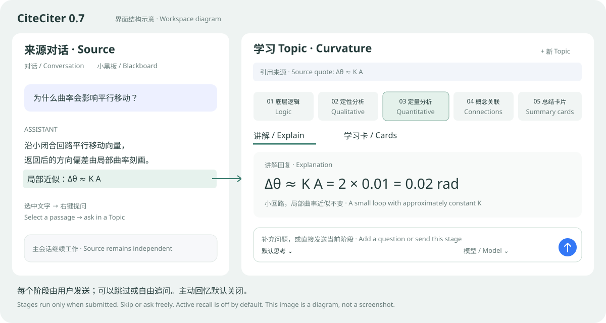
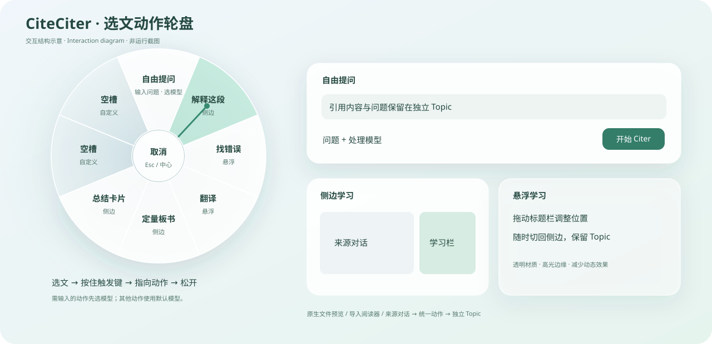
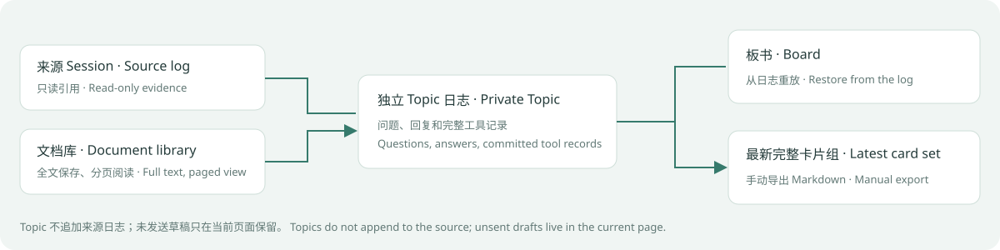

# CiteCiter

[English](README.en.md) · [npm](https://www.npmjs.com/package/@kirkchinese/dsh-citeciter) · [问题反馈](https://github.com/kirkchinese/CiteCiter/issues)

CiteCiter 是 DeepSeek Harness 的学习插件。它从主对话、工具结果或导入文档建立独立 Topic，提供讲解、板书和学习卡片。Topic 的问答与工具记录保存在独立日志中，来源会话继续工作。



上图是功能布局示意图。宽窗口并排显示来源和学习栏；空间不足时学习栏移到下方。

## 版本与宿主

| 插件 | 状态 | 宿主基线 |
| --- | --- | --- |
| 0.6.0 | 已发布的稳定版 | DSH 0.1.2-rc.1 / Desktop 2.0.5 |
| 0.7.0-beta.3 | 本分支开发版，未发布 npm | DSH 0.1.5-rc.1 / Desktop 2.0.9，五阶段路线、轮盘与学习卡 |
| 0.5.0 | 旧宿主适配版 | DSH 0.1.1-rc.1 / rc.2 |

本页功能说明对应 0.7 开发版；安装 0.6.0 不会获得五阶段路线和学习卡。Desktop 指 [anywhere-labs/dsh-desktop](https://github.com/anywhere-labs/dsh-desktop)。Node.js 要求 `^22.19.0 || >=24.0.0`，本机验收使用 Windows 和 Node 24.19.0。当前开发目标为 DSH 0.1.5-rc.1 / Desktop 2.0.9；alpha、next 与 TUI 不在本轮范围内。

## 选文轮盘



上图是交互示意，非运行截图。轮盘、提问框和悬浮窗使用半透明玻璃、背景模糊和短动效；提供减少动态效果和提高对比度样式。

选中文本后按住鼠标右键，移向目标动作，确认高亮后松开。无需输入的动作使用设置中的默认模型；未指定时跟随来源。标记“需输入 · 选模型”的动作先打开提问框，输入问题并选择处理模型后发送。

| 槽位（从正上方顺时针） | 默认动作 | 输入 | 默认位置 |
| --- | --- | --- | --- |
| 1 | 自由提问 | 需要 | 侧边 |
| 2 | 解释这段 | 无需 | 侧边 |
| 3 | 找错误 | 无需 | 悬浮 |
| 4 | 翻译 | 无需 | 悬浮 |
| 5 | 定量板书 | 无需 | 侧边 |
| 6 | 总结卡片 | 无需 | 侧边 |
| 7、8 | 空槽 | — | — |

中心、空槽、轮盘外、Esc、失焦和来源切换取消操作。右键短按保留可点击轮盘；方向键切换，Enter 确认，数字 1–8 直接选择。Shift + 右键保留原生菜单。工具结果入口引用整张工具卡；阅读器引用选中文本。

在“设置 → CiteCiter → 选文轮盘”选择触发键和默认模型。触发键支持右键、Alt/Option、Control、Shift、Meta/Command。每槽可编辑名称、提示词、是否输入问题、问答/学习讲解方式及侧边/悬浮位置；可移动、清空、恢复默认草稿，点击“保存八个槽位”后生效。自定义模式沿用 Topic 的只读工具边界。

提交期间阻止重复执行。失败保留问题、模型和来源供重试；切换来源会话取消未发送的动作。已被宿主接受的 Topic 创建不会因此撤销。模式提示词作为普通用户消息写入 Topic 日志。

## 原生文件预览

在 DSH 原生预览的查看方式中选择“CiteCiter 学习”。宿主负责打开、读取和刷新文件；CiteCiter 显示可选取的 UTF-8 源文本。选文后使用轮盘或“选文动作”按钮。支持文本、Markdown 和常见代码文件；开始学习时保存完整快照，后续文件修改不会改写这份来源。原生学习查看方式也使用 500 KiB 分页。

该入口通过可选的 documentPreviews 服务注册。本机 DSH 顶层包为 0.1.5-rc.1，解析安装的文件预览子包为 0.1.5-rc.2；相关开发依赖固定到 rc.2。缺少该服务时，对话轮盘、独立阅读器和 Topic 仍可使用。不能仅凭顶层版本推断原生预览能力。

文件必须携带来源 Session 地址；绝对文件地址不能直接建立学习 Topic。单个快照最多 8 MiB 且不超过 2,000,000 个字符。此入口不接管内置 Markdown、代码、PDF 或 HTML 渲染器的选区，不提供 PDF 文本层、Word 解析或 OCR。

## 学习流程

1. 在主对话中选中已提交的回答或思考文字，通过轮盘启动动作。也可以使用工具结果引用入口，或点击学习栏的 `+ 新 Topic` 创建自由问答、学习讲解。
2. 在 Topic 中选择一个阶段，补充问题后发送。阶段可以跳过、重复或切回“自由追问”；点击阶段按钮本身不调用模型。
3. 在“讲解 / 板书 / 学习卡”间切换。板书默认按条目阅读，也可以切换画布查看位置关系。
4. 选择“总结学习卡片”并发送。模型通过 `learning_cards` 提交完整卡片组后，在“学习卡”中阅读、导出，或通过追问修订。

| 阶段 | 请求内容 |
| --- | --- |
| 底层逻辑 | 定义、机制、成立条件 |
| 定性分析 | 趋势、边界、反例与直觉 |
| 定量分析（板书） | 变量、单位、假设、推导与算例；不适合量化时说明原因 |
| 概念关联 | 前提、相近概念、区别与应用 |
| 总结学习卡片 | 结论、例子、自测问题与参考答案 |

**主动回忆默认关闭。** 关闭时直接显示结论和例子；开启后先显示问题，再手动展开参考内容。该设置不安排复习任务，没有间隔复习、提醒、打卡或掌握分数。

追问建议和板书引用只追加到草稿，由用户发送。板书引用保留当前学习阶段；需要直接解释时，先切换“自由追问”。`Ctrl / ⌘ + Enter` 发送，Enter 换行。阶段指令会作为普通用户消息写入 Topic；选中某阶段不代表已经掌握。

## 文档阅读

点击底部 📖，导入 `.txt`、`.md` 或 `.markdown` 文件。阅读器保存全文，每页最多显示 500 KiB 的 UTF-8 文本；单次导入最多 2,000,000 个字符。使用“上一页 / 下一页”翻页，选中文字、输入问题，再点击 `Citer!`。

创建成功后，阅读器自动收起并打开学习栏。失败时保留选区和问题供重试。翻页清除旧选区、保留未发送问题。Markdown 以源文本显示；不直接解析 PDF、Word、网页或 OCR。

文档 Topic 可以读取和搜索导入文档；启用“允许读取来源项目文件”时，也可以使用项目文件的只读搜索与读取工具。它不能修改项目文件或运行命令。

## Topic 管理与布局

| 操作 | 行为 |
| --- | --- |
| 顶部 Topic 选择器 | 切换当前来源会话下的 Topic |
| Topic 设置 | 重命名、选择模型和推理强度、归档或删除 |
| 停止 | 停止当前生成，之后可以继续追问 |
| 查看归档 | 切换到归档列表；恢复后回到活动列表 |
| 永久删除 | 需要输入完整 Topic Session ID；不删除来源会话 |
| 切为侧边 / 切为悬浮 | 保留 Topic 与草稿；悬浮窗可拖动标题栏 |
| 关闭学习栏 | 恢复宿主布局；再次打开保留当前页面的 Topic 草稿 |

面板偏好比例为 28%–55%。宽窗口为学习栏单独分配空间，并保留主对话至少 480 CSS 像素；原生详情打开后空间不足时改用上下布局。窄布局默认收起阶段导航和阅读视图的输入框，可手动展开。宿主模态窗口打开时，CiteCiter 浮层暂时隐藏，关闭后恢复。原生侧栏全屏时侧边学习栏让出空间，提示中可选择“悬浮查看”；退出全屏后恢复侧边栏。学习栏移到下方是空间不足时的布局退让，不是另一种学习流程；希望继续对照阅读时可切为悬浮。

内容通过公开 slots 接入；尺寸分配由 `host-dock.ts` 中的版本适配器维护。无法识别的宿主布局显示兼容提示。手势、动作状态、执行、文档来源和 React 视图分别维护。宿主升级后需要重新验收。

## 数据与边界



| 数据 | 保存与恢复 |
| --- | --- |
| Topic 问答、阶段请求、板书 | 写入私有 Topic 日志，重启后恢复 |
| 学习卡 | 显示最新成功提交的完整一组，旧组留在日志；无效或未完成记录不覆盖上一组 |
| 卡片导出 | 手动下载 Markdown，包含卡片、Topic 标识和来源引文 |
| 轮盘配置、默认模型 | 宿主 CiteCiter 设置 |
| 未发送草稿、临时视图选择、浮窗位置 | 当前页面内保留；刷新或重启不恢复 |
| 导入文档与原生文件快照 | 保存在 `$DSH_HOME/citeciter/documents/` |

Observer 按需读取来源的已提交事件；Exact Fork 继承已结束来源轮次的上下文。Topic 不向来源 Session 追加事件。板书支持公式、Markdown、表格、安全 SVG、隔离 HTML 和内嵌图片；内容渲染受限制。

Topic 索引位于 `$DSH_HOME/citeciter/workspaces/`，私有日志位于 `$DSH_HOME/citeciter/sessions/`。未指定 `DSH_HOME` 时通常使用用户目录下的 `.dsh`。DSH 负责旧日志的格式迁移；只读打开不改写原文件，继续写入时由宿主创建当前格式文件。Exact Fork 使用恢复后的继承边界。历史引文保留原文，原事件序号可能随宿主迁移变化。升级前备份整个 home。Web 与 Desktop 同时运行时使用不同 home，避免并发写入同一存储。

模型决定讲解内容与工具调用，阶段按钮不保证模型一定生成板书或卡片。当前没有独立卡片编辑器、跨 Topic 搜索、知识图谱数据库或跨设备同步。

## 本地安装 0.7 开发版

最新版宿主使用本分支的 `0.7.0-beta.3`。稳定 `0.6.0` 对应旧宿主，安装说明保留在 [0.6.0 Release](docs/releases/v0.6.0.md)。在本分支仓库根目录执行：

```powershell
npm install -g @deepseek-ai/dsh@0.1.5-rc.1
pnpm install --frozen-lockfile
pnpm typecheck
pnpm test
pnpm build
pnpm test:snapshot
pnpm --dir packages/citeciter pack --pack-destination "$PWD/.refs/artifacts"
$env:DSH_HOME = Join-Path $env:USERPROFILE '.dsh-citeciter-preview'
dsh plugin --profile web add "$PWD/.refs/artifacts/kirkchinese-dsh-citeciter-0.7.0-beta.3.tgz"
dsh --profile web --host 127.0.0.1 --port 10537 --no-open
```

首次打开 Web 时，使用启动终端输出的完整登录链接（包含 `?token=…`）。登录成功后，DSH 会设置会话 Cookie 并跳转到不含 token 的地址；随后可直接刷新。省略首次登录参数会返回 HTTP 401，部分自动化浏览器会将该文本响应显示为 `ERR_BLOCKED_BY_CLIENT`。登录链接属于该宿主的访问凭据，不要写入文档或提交到 Git。

如 npm 拦截依赖安装脚本，按 npm 输出的包名单一次性允许后重装。安装 Desktop [2.0.9](https://github.com/anywhere-labs/dsh-desktop/releases/tag/v2.0.9)，它内置同版 DSH；更新全局 CLI 不会更新桌面运行时。选择未占用的端口。Desktop 使用另一个 home，从设置了该 `DSH_HOME` 的终端启动桌面程序，再在 Desktop 自带终端执行 `dsh plugin add <tarball 的绝对路径>`。全局 CLI 不能管理保留的 `desktop` profile。一个 home 同时只运行一个宿主。安装后重启宿主并刷新客户端。

`test:snapshot` 使用无密钥模型和一次性真实 DSH profile，校验五阶段、板书、卡片、重启恢复和管理操作。确定性测试验证程序行为，不评定模型的教学质量。详细结果和未覆盖项目见 [验收记录](docs/validation/2026-09-11-wheel.md)。

开发命令与打包流程见 [贡献指南](CONTRIBUTING.zh.md)，本分支变更见 [0.7 开发说明](docs/releases/v0.7.0-beta.3.md)。构建和打包不会发布 npm。

## 社区与许可证

DSH-Citeciter QQ 群：`1108040435`。许可证：[MIT](LICENSE)。
