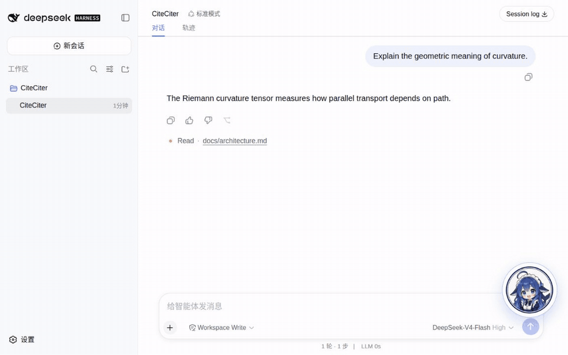
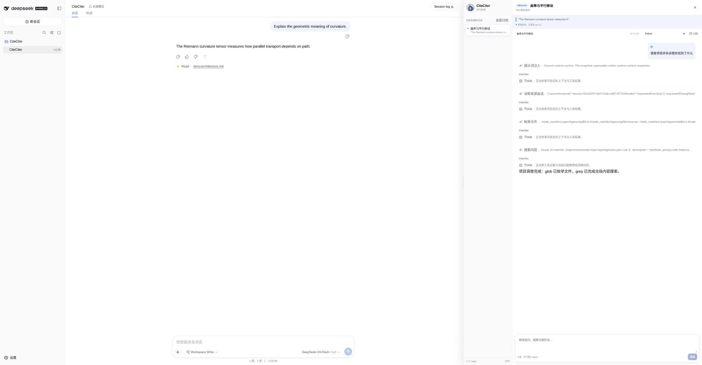
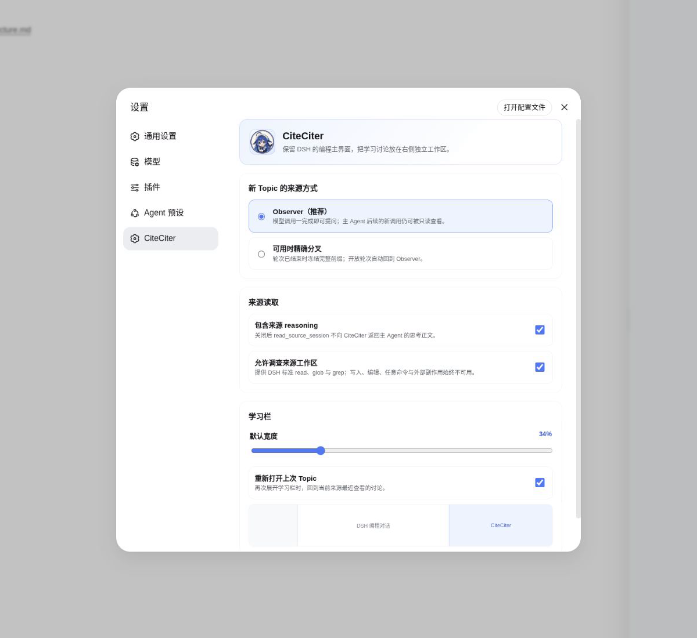
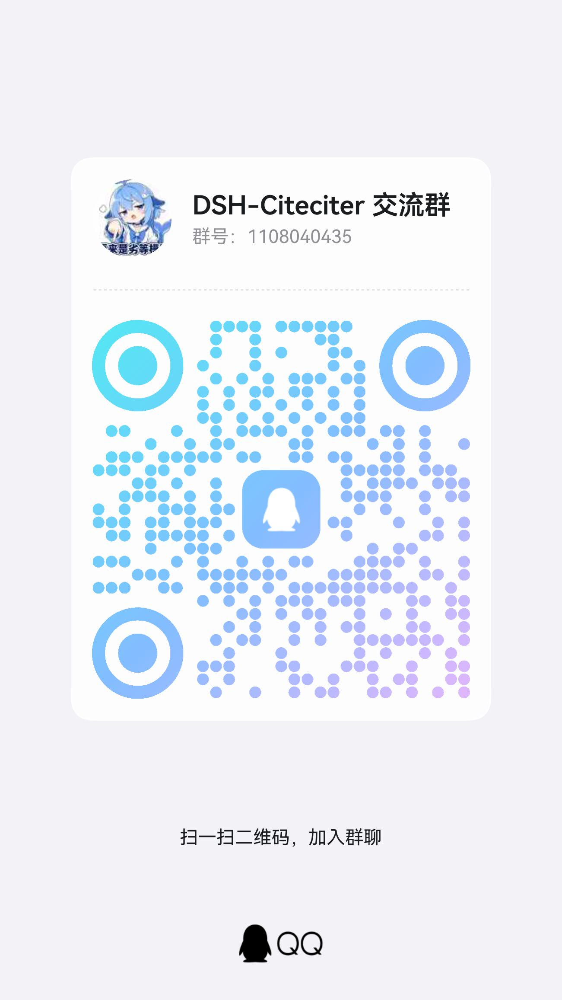

<h1 align="center">CiteCiter</h1>

<p align="center"><strong>对 DSH 回答里的某一句追到底，不打断正在进行的主任务。</strong></p>

<p align="center">面向交互式 DeepSeek Harness、与来源精确绑定的只读旁路调查。</p>

<p align="center">
  <a href="https://www.npmjs.com/package/@kirkchinese/dsh-citeciter"></a>
  <a href="LICENSE"></a>
</p>

<p align="center">
  <a href="README.md">English</a> ·
  <a href="https://www.npmjs.com/package/@kirkchinese/dsh-citeciter">npm</a> ·
  <a href="https://github.com/kirkchinese/CiteCiter/issues">问题反馈</a>
</p>

<p align="center">
  
</p>

<p align="center"><sub>划选、右键、就地追问；主 Agent 继续工作。画面录制于可复现的测试环境，用来展示交互，不代替真实模型或安装包验收。</sub></p>

长任务进行到一半，Agent 的某句话值得深挖，但你又不想把主任务带偏——CiteCiter 正是为这种时刻准备的。它在来源对话旁边打开一条独立调查，把后续问题与所选原文牢牢绑定，同时保持来源 Session 和工作区不变。

## 为什么用 CiteCiter

- **原句不会漂移。** 创建 Topic 前，CiteCiter 会把选中文字与已经提交的助手回答重新核对。
- **不用等主任务结束。** 只要一次模型回答已经提交，外层 Agent 轮次仍在运行也能立即开始追问。
- **调查可以持续。** 每个 Topic 都支持自然的多轮续问，刷新或重启后还能重新打开。
- **结论可以核查。** CiteCiter 能只读检查来源 Session 中已提交的事件，也能搜索和阅读项目文件。
- **不动原现场。** 调查在独立的只读 Session 中运行，不能写入来源 Session 或来源工作区。

## 谁会真正需要它

CiteCiter 尤其适合这些交互式 DSH 用户：

- 正在跑长任务，想澄清一个局部问题，又不愿打断主 Agent；
- 审阅 AI 生成的代码或结论，需要回查会话记录和仓库证据；
- 学习陌生代码库，希望把“为什么”留在一条可恢复的长期讨论里。

它并不面向所有 DSH 场景。TUI、headless 和纯自动化流程目前没有 CiteCiter 交互入口。

## 0.4.1 发布后安装

CiteCiter 0.4.1 当前仍是源码候选，尚未完成发布验收。运行范围为 Node.js `^22.19.0 || >=24.0.0` 与 DSH `>=0.1.1-rc.1 <0.1.1-rc.3`。

DSH Web 使用：

```sh
dsh plugin --profile web add @kirkchinese/dsh-citeciter@0.4.1
```

安装后重启 DSH Web 并刷新页面。DSH Desktop 请打开托盘终端并运行：

```sh
dsh plugin add @kirkchinese/dsh-citeciter@0.4.1
```

正式 Desktop 安装包已经自带 Node.js、pnpm 和固定版本的 DSH。使用外部 DSH 安装时，也可以显式指定 Desktop profile：

```sh
dsh plugin --profile desktop add @kirkchinese/dsh-citeciter@0.4.1
```

安装后重启 DSH Desktop。

## 四步开始追问

1. 在已经提交的助手回答中选择文字；外层 Agent 轮次可以仍在运行。
2. 右键选区，输入第一个问题，然后点击 `Citer!`。
3. 在来源对话旁边的面板里继续追问。
4. 从 Topic 栏重新打开、重命名、归档或恢复以前的讨论。

每个 Topic 都有自己的模型、思考强度、标题、消息和来源绑定；调整这些内容不会改变来源 Session。

## 能核查什么，不会改动什么

| 对象 | CiteCiter 可以做 | CiteCiter 不会做 |
|---|---|---|
| 选中的回答 | 重新核对并保留已经提交的精确原文范围 | 把仍在流式输出的片段当作引用 |
| 来源 Session | 有界读取已提交事件；默认模式还能读取后来提交的新事件 | 追加、重写或引导主 Session |
| 项目工作区 | 在 DSH 文件服务可用时发现、搜索和阅读文件 | 创建、编辑或删除项目文件 |
| 调查 Topic | 在 `$DSH_HOME/citeciter/` 下持久保存独立的多轮讨论 | 冒充或修改普通来源 Session |

## 调查过程一目了然

<p align="center">
  
</p>

<p align="center"><sub>引用原文、问题、回答、来源读取和项目文件核查都留在同一面板。该截图来自确定性测试场景，不代表正式 Desktop 安装包或真实模型验收。</sub></p>

<p align="center">
  
</p>

## 两种来源模式

默认的 **Observer** 会按需读取来源中已经提交的证据。一次模型回答完成后即可开始，即使整个 Agent 轮次尚未结束；后续新提交的事件也能继续读取。

高级的 **Exact Fork** 适合已经结束的来源轮次。`exact-when-available` 会在稳定边界存在时使用 Exact Fork，否则回退到 Observer。0.4.1 不改变现有 Topic 文件和设置格式。

## 兼容性与验证状态

| 宿主 | CiteCiter 版本 | 当前证据 |
|---|---|---|
| DSH Web `0.1.1-rc.2` | `0.4.1` 候选 | 本地自动化与确定性测试场景检查通过；发布验收尚未完成 |
| [DSH Desktop 2.0.2](https://github.com/anywhere-labs/deepseek-harness-desktop)（内置 DSH `0.1.1-rc.2`） | `0.4.1` 候选 | 当前目标宿主；Windows x64 与 macOS universal 安装包验收尚未完成 |
| [dataelement DSH Desktop](https://github.com/dataelement/dsh-desktop) 源码开发壳（内置 DSH `0.1.1-rc.1`） | 仅 `0.4.0` | 历史上的有条件 Linux 源码壳证据 |
| DSH Web `0.1.0-rc.7` | `0.3.2` | 旧版稳定线 |

## 从旧版本升级

待 v0.4.1 发布后，升级实际使用的 profile 并检查解析版本。Web 使用：

```sh
dsh plugin --profile web add @kirkchinese/dsh-citeciter@0.4.1
dsh plugin --profile web list --depth 0
```

Desktop 托盘终端使用不带 `--profile web` 的同类命令；外部 DSH 安装使用 `--profile desktop`。从 v0.3 升级不会迁移或重写已有 Topic、设置或来源 Session。仍在 DSH `0.1.0-rc.7` 上运行的用户应继续使用 CiteCiter 0.3.2。

## 已知限制

- 选区中必须至少包含一段已经提交的助手回答；纯用户消息、纯工具行和仍在流式输出的片段不能作为引用锚点。
- 渲染器生成的 KaTeX 排版和脚注编号没有稳定原文坐标，不能直接引用。
- 项目文件访问依赖当前 DSH 文件系统服务，并始终保持只读。
- Read Frog 翻译选区是 DSH rc.1/rc.2 上的 best-effort 兼容路径；普通 DSH 选区不依赖它。
- DSH 尚未提供公开的增量右侧 dock 布局扩展点。只要 frame 能同时容纳学习栏和可用的主对话，CiteCiter 就使用可逆、锁定版本的 AppFrame 兼容适配器让主对话腾出空间，并暂时隐藏可见的 details 列；空间不足时才回退为覆盖面板。
- Desktop loopback 端口改变时，浏览器 origin 也会改变。此时 CiteCiter 会重新打开最近更新的 Topic；如需精确恢复上次查看位置，请使用固定端口。
- DSH 仍处于预发布阶段，后续 API 版本可能要求同步更新 CiteCiter。

## 交流与反馈

欢迎加入 DSH-Citeciter QQ 群（群号 `1108040435`），交流使用方式、功能想法和兼容性问题。

<p align="center">
  
</p>

## 参与贡献

欢迎提交 Issue 和 Pull Request。提交代码前请阅读[贡献文档](CONTRIBUTING.zh.md)。

## 许可证

[MIT](LICENSE) © CiteCiter contributors
