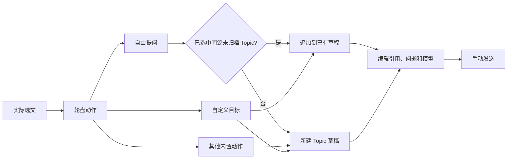

# CiteCiter

[English](README.md) · [npm](https://www.npmjs.com/package/@kirkchinese/dsh-citeciter) · [问题反馈](https://github.com/kirkchinese/CiteCiter/issues)

> **0.8.0 已弃用。** Linux 通过符号链接启动 DSH 时，可能无法创建或恢复 Topic，报找不到 `@deepseek-ai/dsh-agent-loop`。使用 DSH 0.1.5-rc.1 / Desktop 2.0.9 时，请升级到 [0.8.2](https://github.com/kirkchinese/CiteCiter/releases/tag/v0.8.2)；DSH 0.1.7 请先阅读下方兼容说明。

CiteCiter 为 DeepSeek Harness 提供带来源引用的独立工作区。可从主对话、工具结果和文档建立 Topic，处理文字、编程、图像和学习任务。新 Topic 使用 DSH 原生会话、权限、模型、附件与消息队列，来源对话继续独立工作。

[](https://www.bilibili.com/video/BV1tqeA65EJ8/)

[在 B 站观看演示](https://www.bilibili.com/video/BV1tqeA65EJ8/)。视频展示已发布版本；本分支的轮盘分流和 alpha 适配见下文。


上图为 0.8 工作区示意，非运行截图，其中学习路线处于手动开启状态。本分支的引用流程如下；模型仍在用户发送后才开始回答。



## 版本与安装

本版为 **0.9.0-alpha.1 预发布版（npm next）**，适配 Web DSH `0.1.7-rc.2` 和 [DSH Desktop 2.0.15](https://github.com/anywhere-labs/dsh-desktop/releases/tag/v2.0.15) 内置的同版 DSH。保留 DSH `0.1.5-rc.2` 的独立 Host/Client 编译检查；旧版编译通过不代表最新 Desktop 功能通过。Web 与 Desktop 的真实模型验收范围见文末记录；不将旧 SDK 编译结果视为实机功能验证。已发布正式版为 **0.8.2**，兼容基线为 DSH `0.1.5-rc.1` / Desktop `2.0.9`。Node.js 要求 `^22.19.0 || >=24.0.0`。本轮不验收 Linux。

**DSH 0.1.7 不能使用 0.8.2。** 旧版的精确 peer 范围不匹配；强制安装后还会因 Typert 缺少 `create()` 工厂而启动失败，见 [Issue #9](https://github.com/kirkchinese/CiteCiter/issues/9)。本版已适配 RC2 的版本检查及 Host/Remote 工厂接口，无需 `allow-version`。请安装本预发布版，不要将旧版强行加入兼容例外。

| 版本 | 状态 | 主要差异 |
| --- | --- | --- |
| 0.9.0-alpha.1 | 预发布，npm next | 双宿主适配、持久草稿、PTC 工具展示、引用追加与学习路线约束 |
| 0.8.2 | 正式版 | 明确来源读取上界与续读位置，恢复原生 Topic 首答建议追问 |
| 0.8.1 | 已发布 | 修复 Linux/macOS 符号链接启动时无法打开 Topic |
| 0.8.0 | 已弃用，请升级 0.8.2 | Linux 符号链接启动错误会阻止 Topic 打开 |
| 0.7.0-beta.3 | 前一开发候选版 | 私有只读 Topic、选文轮盘、手动五阶段学习 |
| 0.6.0 | 已发布 | DSH 0.1.2-rc.1 / Desktop 2.0.5 基线 |

DSH 0.1.7 用户安装本预发布版：

```powershell
npm install -g @deepseek-ai/dsh@0.1.7-rc.2
dsh plugin --profile web add @kirkchinese/dsh-citeciter@0.9.0-alpha.1
dsh web
```

`next` 指向此预发布系列；`latest` 保持 0.8.2，只适用于 DSH 0.1.5-rc.1 / Desktop 2.0.9。旧宿主 DSH 0.1.2-rc.1 / Desktop 2.0.5 应继续使用 @kirkchinese/dsh-citeciter@0.6.0。如 npm 提示本地原生依赖的安装脚本被阻止，按 npm 输出对明确列出的依赖放行后重装。不要通过全局关闭脚本限制解决。

0.8.0 在 Linux/macOS 通过符号链接启动 DSH 时，可能无法打开 Topic，报找不到 dsh-agent-loop。0.8.1 先解析 CLI 入口真实路径再加载宿主模块，保留 Desktop 的 app.asar 路径。Linux 原生 Node 回归已通过，macOS 尚未实测。

本地构建并安装此分支：

```powershell
npm install -g @deepseek-ai/dsh@0.1.7-rc.2
pnpm install --frozen-lockfile
pnpm typecheck
pnpm typecheck:desktop
pnpm build
pnpm --dir packages/citeciter pack --pack-destination E:/project/CiteCiter/.refs/artifacts
dsh plugin --profile web add E:/project/CiteCiter/.refs/artifacts/kirkchinese-dsh-citeciter-0.9.0-alpha.1.tgz
```

Desktop 使用自己的内置 DSH。0.8.2 对应已验收的 Desktop 2.0.9 基线；本版针对 Desktop 2.0.15，在其管理终端执行 `dsh plugin add @kirkchinese/dsh-citeciter@0.9.0-alpha.1`。全局 CLI 更新不会更新 Desktop 内置运行时。安装后重启相应宿主。同一 DSH home 不要同时运行 Web 和 Desktop 写入进程。

已知宿主限制：Windows 只读 PowerShell 的编码初始化可能被受限语言模式拒绝，部分中文输出可能乱码。Citer 保留原始错误，不提高权限或隐藏输出；此问题等待 DSH 修复。本次预发布不包含 Linux/macOS 或 Desktop NEXT 外壳的实机验收声明。

## 来源读取与建议追问

`read_source_session` 按字节预算分页。`sourceMaxSeq` 是本次快照的可读上界；`availableThroughSeq` 是旧版请求上界标记，不能用它判断来源结束。`hasMore` 为 true 时，以 `nextFromSeq` 作为下一次 `fromSeq`，省略 `throughSeq` 继续读取。`truncated` 只表示当前范围因字节预算停止；空页、过滤事件及超大内容占位不代表来源不存在。Observer 每次读取当前已提交事件，Exact Fork 只读取继承前缀。

原生 Topic 的首答默认提供三条建议追问，可在 CiteCiter 设置中关闭。用户本次要求不附建议、只给结果或严格限定格式与篇幅时，提示词要求省略追问。点击建议只填入草稿，手动发送后才调用模型。来源说明和建议追问由独立提示词模块提供；来源内容继续按已发送附件读取。

## 草稿与引用

1. 在主对话选中文字，按住右键打开八槽轮盘，移向动作后松开。也可从工具结果、文档阅读器或原生文件预览创建 Topic。
2. “自由提问”把选文加入当前选中的未归档 Topic；未选中或当前 Topic 已归档时新建。其他内置动作默认新建，自定义动作可选择目标。只在当前来源会话内追加，保留已有草稿、模型和权限。来源地址与选文显示为可移除附件；加号仅选择实际图片或文件，不生成引用。
3. 检查问题、引用、权限和模型，点击发送或按 Enter。Shift + Enter 换行；输入法组词期间 Enter 不发送。

创建 Topic、选择轮盘动作、切换模型、引用板书均不调用模型。轮盘动作直接进入 Citer 输入框，在同一处编辑问题、引用和模型，再手动发送。自定义动作追加到已有 Topic 时，其提示词追加在已有草稿后。模式提示词和发送时的引用写入 Topic 原生日志。

未发送的来源附件被删除后，来源读取工具会拒绝读取该来源；新 Topic 不隐式复制来源历史。已经发送的附件属于历史消息，删除后续草稿中的副本不会撤回历史上下文。草稿的文字、真实引用和附件内容保存在所属 Topic 的 `draft/` 目录，关闭面板、切换 Topic、刷新和重启后恢复；恢复本身不发送消息。模型、思考强度和权限以宿主保存的状态为准。后台窗口的轮询不改写上次使用的 Topic；导航恢复按主动操作记录。

草稿不写入模型日志，也不授予来源读取权限。宿主确认接收后，只清除本次提交内容，发送期间新增的编辑保留。发送失败保留草稿；响应丢失时显示待核对状态，用户核对或明确重试后才继续。并发保存冲突保留本地输入并提示选择版本；明确保留本窗口时，会重新保存被另一窗口移除、但本窗口仍持有的附件；缺失或损坏附件明确报错。永久删除 Topic 同时删除其草稿。旧 Desktop 遇到较新的会话日志格式时拒绝写入，须回到新版 Web 继续，不手工降级日志。

## 权限、输入与队列

模型菜单支持方向键、Home/End 与 Enter。切换子菜单后焦点留在菜单内，保存期间模型按钮保留焦点并阻止重复操作。

新 Topic 默认 **只读**，即使来源会话具有完全权限。输入框的权限菜单使用 DSH 的只读、工作区内修改、完全权限模式。只有用户主动选择模式或更改新 Topic 默认值后，才允许相应修改。DSH 审批、沙箱和工具限制继续生效；插件不绕过权限服务。

输入框从左到右为附件、权限模式、模型与思考强度、发送。模型菜单先选模型，再选该模型支持的思考强度。图片和普通文件通过 DSH 原生附件服务发送，文件显示上传状态，失败可重试。可从附件菜单选择文件，在输入框粘贴图片，或拖入 Citer 面板。拖放提示显示接收的 Topic，松开只向该 Topic 添加附件；没有可用 Topic 时不接收。主对话不会收到拖入 Citer 的副本。混合粘贴时同时保留图片与文字。已发送文件显示下载图标与文件名，点击保存原附件。点击历史图片在宿主内预览；按 Esc、点击遮罩或关闭按钮返回，键盘焦点恢复到原图片。用户消息不显示角色标签。宿主拒收时显示原因并保留草稿；宿主已接收的消息不会因后续状态读取失败而重新留在输入框。

回答运行时，Enter 和发送按钮跟随 DSH 设置中的“繁忙时的发送行为”；Ctrl + Enter 临时使用另一种方式。排队在当前轮结束后处理，插话由 DSH 在当前轮的下一步接收。输入区的切换按钮只覆盖当前 Topic，不改写宿主默认值。队列显示待处理内容，可移除或转为插话。停止结束当前回答并保留已生成内容；待处理队列继续遵循 DSH 规则。

新 Topic 可使用标准编程工具，操作范围由 DSH 权限决定。旧版记录迁入来源目录后仍保留原有对话和权限。迁移会逐条核验日志；无法核验的记录保留原存储并报告，不自动扩大权限。

DSH 工具审批、补充问题和计划确认显示在对应 Topic 中，决定交回宿主原生交互处理。审批卡保留工具名称、理由及关联参数供查看。

模型返回的思考内容显示为可展开的“思考”行；生成思考而尚无正文时显示“思考中”。折叠状态保留一行预览，展开后显示完整 Markdown。未返回思考内容的模型不显示空行。

手动发送被宿主接收后，消息区跳到最新内容。仅模型继续输出时，保留用户向上阅读的位置。

## 学习、板书与图片

“学习路线”默认关闭。关闭时，当前提示词明确禁止从旧消息或旧待办恢复教学路线；单次讲解或板书不等于开启路线，也不禁用编程任务的普通计划。开启后，用户发送问题时要求模型通过 DSH `todo_write` 自行选择、排列和更新学习计划。可选方式包括底层逻辑、定性分析、定量板书、概念关联和总结卡片，按内容取舍。用户指定的范围、篇幅、工具限制和卡片数量优先，不按阶段扩充任务。

小黑板统一显示在主区“小黑板”标签。支持文本、Markdown、公式、表格、SVG、图片和隔离 HTML。板书引用进入草稿附件，公式渲染为数学内容，不显示原始对象字段。学习卡在 Citer 的“学习卡”视图查看、导出和修订。示例分为文字与代码：文字按 Markdown 展示，代码使用原生代码块，保留语言、换行、缩进及复制按钮。导出包含代码围栏，旧卡片继续兼容。

`blackboard_view` 把浏览器真实渲染的 PNG 返回给支持视觉输入的模型。模型可检查遮挡、标签、箭头和布局后继续修改板书。截图仅包含板书，不包含主对话或窗口布局；切换 Topic、关闭 Citer 面板或窄屏隐藏板书后，独立截图模块仍按请求中的 Topic 和版本使用相同组件进行 1000×680 离屏渲染。需保持 DSH Web 或 Desktop 页面连接。SVG 保留原始颜色，Markdown 代码使用适合深色板书的背景。沙箱 HTML iframe 暂不支持截图，需改用 SVG 才能进行此视觉检查。

宿主中的兼容插件可向 Topic 提供 `codex_connect_image_generate` 和 `view_image`，Citer 不代替其账户配置。当前使用上游 [dsh-codex-connect](https://github.com/franksong2702/dsh-codex-connect) `0.1.0-alpha.4.52`，同时支持 DSH RC1/RC2，不需要本地补丁或版本例外。图像能力默认关闭：在设置 → 内置插件 → Codex Connect → 能力中启用「GPT Image 图片生成」并保存。Web 与 Desktop 分别使用自己的 Profile，需要分别配置；安装插件本身不会启用工具。`view_image` 有独立的「启用 view_image 工具」开关；图片生成开关不会同时启用它。图像生成、上传图编辑和结果显示以[当前联调记录](https://github.com/kirkchinese/CiteCiter/blob/feat/dsh-latest-usability/docs/validation/2026-09-27-connect-450.md)为准，旧版本结果不替代当前验收。

请求总结卡片时，模型先核对定义、条件、推导、数值及前后矛盾，再保存完整卡片组；无法核实的内容应标明或省略。自查不能保证知识正确，验收中已发现并纠正模型错误，见[验收记录](https://github.com/kirkchinese/CiteCiter/blob/feat/dsh-latest-usability/docs/validation/2026-09-12-native-real-model.md)。主动回忆默认关闭，可在卡片中开启；不提供间隔复习、提醒或打卡。

## Topic 与布局

点击列表图标浏览、搜索并切换当前来源的 Topic；＋建立空 Topic。双击标题或按 F2 重命名，Enter/失焦保存，Esc 取消。归档用于隐藏并保留记录，可从归档列表恢复。在归档 Topic 中手动发送新消息后，Topic 自动回到活动列表；发送被宿主拒绝时保留归档状态和草稿。永久删除要求输入完整 Session ID，只删除 Citer 自己维护的 Topic 目录；删除前停止并释放该 Topic，拒绝符号链接及越界路径。主 Session 不删除。

宽窗口并排显示来源和 Citer，可拖动分隔线调整比例。拖动标题栏离开侧边后变为悬浮窗；拖回窗口右缘释放后停靠。空间不足时打开原生文件详情，Citer 暂时收起；关闭详情后恢复同一 Topic、草稿和模型。主动点击 Citer 入口或从文件选文时，可切回 Citer 独立页面，左上角返回键释放原界面。没有详情时，窄屏直接使用此独立页面，不把学习栏放到下方。关闭面板恢复宿主空间；Desktop 标题栏保留。

菜单和面板使用半透明背景、背景模糊与短动效，支持宿主主题和系统减少动态效果设置。布局适配集中在独立模块中，未知宿主结构不会强制覆盖主界面。

## 会话存储与迁移

Citer 的 Topic 只出现在 Citer 列表。DSH 的会话磁盘索引不递归扫描 Topic 子目录；插件独立维护实时成员和导航，原生发送服务按身份访问当前 Topic。

```text
.dsh/sessions/<工作区>/<主Session>/
├── session.v4.jsonl[.zstd]       主会话，由 DSH 管理
└── citeciter/
    ├── owner.json              来源与目录归属
    ├── <Topic编号>/
    │   ├── topic.json          标题、归档状态、模型和来源
    │   ├── draft/              未发送文字、引用及附件字节
    │   └── sessions/<工作区>/<CiterSession>/session.v4.jsonl
    └── migration-backups/      已核验旧副本的备份
```

新建、归档、恢复和删除均由 Citer 管理。归档保留全文；删除不影响其他 Topic、主 Session 或迁移备份。迁移使用 DSH 公开持久化接口读取和写入，核验头部和全部事件后才切换索引；旧副本保留，清除主列表重复入口时需明确确认移动范围。

alpha 的当前格式为 v4。旧 v3 文件由 DSH 读取及迁移，Citer 不直接改写事件序号或 `seedLength`。仅存在历史日志时仍按来源实体目录定位 Citer 数据。

## 文档与原生预览

Citer 打开时，从右上角“…” → “文档阅读”进入阅读器；关闭 Citer 后保留独立读书入口，避免悬浮按钮遮挡输入区。

点击 📖 导入 `.txt`、`.md`、`.markdown`。阅读器保存全文，每页最多 500 KiB UTF-8 文本，导入最多 2,000,000 字符。翻页清除旧选区、保留问题；选文并准备草稿后自动收起阅读器。文档地址和选文分别作为待发送附件，可独立删除。

文档工具返回 UTF-16 总长度与实际读取区间。搜索结果提供可用终点；读取结果区分请求终点、实际终点和后续内容，续读使用 nextFromOffset。未知终点可省略 throughOffset；越界错误给出具体合法范围，不静默截断。

安装了可选 documentPreviews 服务时，在原生文件预览中选择“CiteCiter 学习”。宿主读取文件，Citer 提供可选取的源文本、分页与引用；创建 Topic 时保存完整快照，文件之后的变化不会改写该快照。单个快照最多 8 MiB / 2,000,000 字符，必须携带来源 Session 地址。

本分支按子包 `0.1.7-rc.2` 的公开类型编译，服务仍为可选。缺少服务时，对话轮盘与独立阅读器仍可用。学习查看方式不提供 PDF 文本层、Word 解析或 OCR。不同文档可追加到同一 Topic；模型按已发送的文档地址选择读取对象。

## 轮盘设置

在“设置 → CiteCiter”选择触发键、默认模型和八个槽位。默认槽位为自由提问、解释这段、找错误、翻译、定量板书、总结卡片、两个空槽；每槽可设置提示词、输入提示、引用目标、内容方式及默认位置。槽位更改需点击保存。

右键短按保留可点击轮盘，Shift + 右键使用原生菜单；可用方向键、数字 1–8 和 Enter 选择。中心、空槽、轮盘外、Esc、来源切换或轮盘失焦取消动作。没有额外的补充问题弹窗；草稿由 Citer 输入框统一管理。

## 兄弟项目

CiteCiter 与同作者的 [Claude2DSH](https://github.com/kirkchinese/claude2dsh) 面向同一类工作流：在多个 agent 工具之间迁移并复用知识。

- **Claude2DSH** —— 把 Claude Code 的会话、技能、子 agent、斜杠命令、记忆与 MCP 服务器迁移为 DSH 原生可续聊会话与资产，并支持反向导出。它负责「把过去的上下文搬进来」，CiteCiter 负责「让搬进来之后的答案可追溯」。

两者遵循同一套约定：只使用公开扩展点、未经显式授权不写入外部工具目录、发布前跑真实 profile 验收。如果你正在整理历史会话，先迁入再引用会顺手很多。

## 开发与验收

[开发规范](https://github.com/kirkchinese/CiteCiter/blob/feat/dsh-latest-usability/CONTRIBUTING.zh.md) · [alpha 变更说明](https://github.com/kirkchinese/CiteCiter/blob/feat/dsh-latest-usability/docs/releases/v0.9.0-alpha.1.md) · [本轮验收状态](https://github.com/kirkchinese/CiteCiter/blob/feat/dsh-latest-usability/docs/validation/2026-09-27-connect-450.md) · [0.8.2 修复说明](https://github.com/kirkchinese/CiteCiter/blob/feat/dsh-latest-usability/docs/releases/v0.8.2.md)

Host 和 Client 分别编译。原生会话适配、来源读取、索引存储、附件、发送队列、板书截图、学习计划和 UI 控件独立实现；不修改 DSH Agent Loop。完整宿主输入组件尚无跨会话嵌入接口，Citer 通过公开 ConversationController / SessionFace 复用行为，不能自动继承所有第三方输入区扩展。

当前分支已移除人工模型提供者、测试目录与临时验收脚本，保留 Git 历史。CI 进行锁文件、类型、构建和打包检查。功能验收使用真实模型、真实来源分支及实际 UI，覆盖情况与未完成项以验收记录为准。

MIT License.
